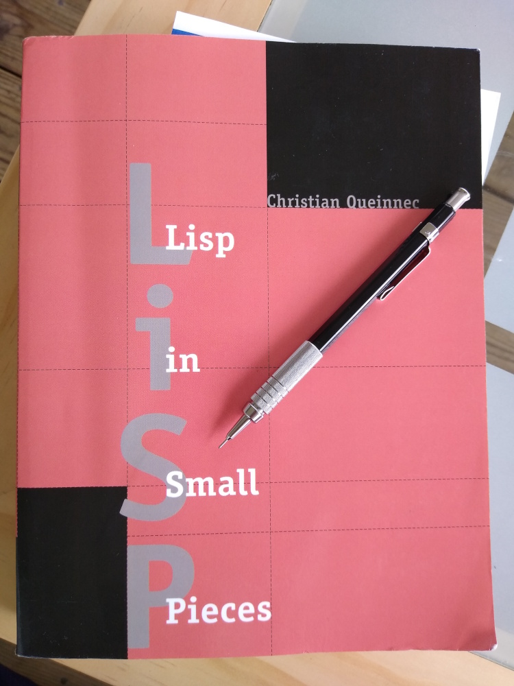
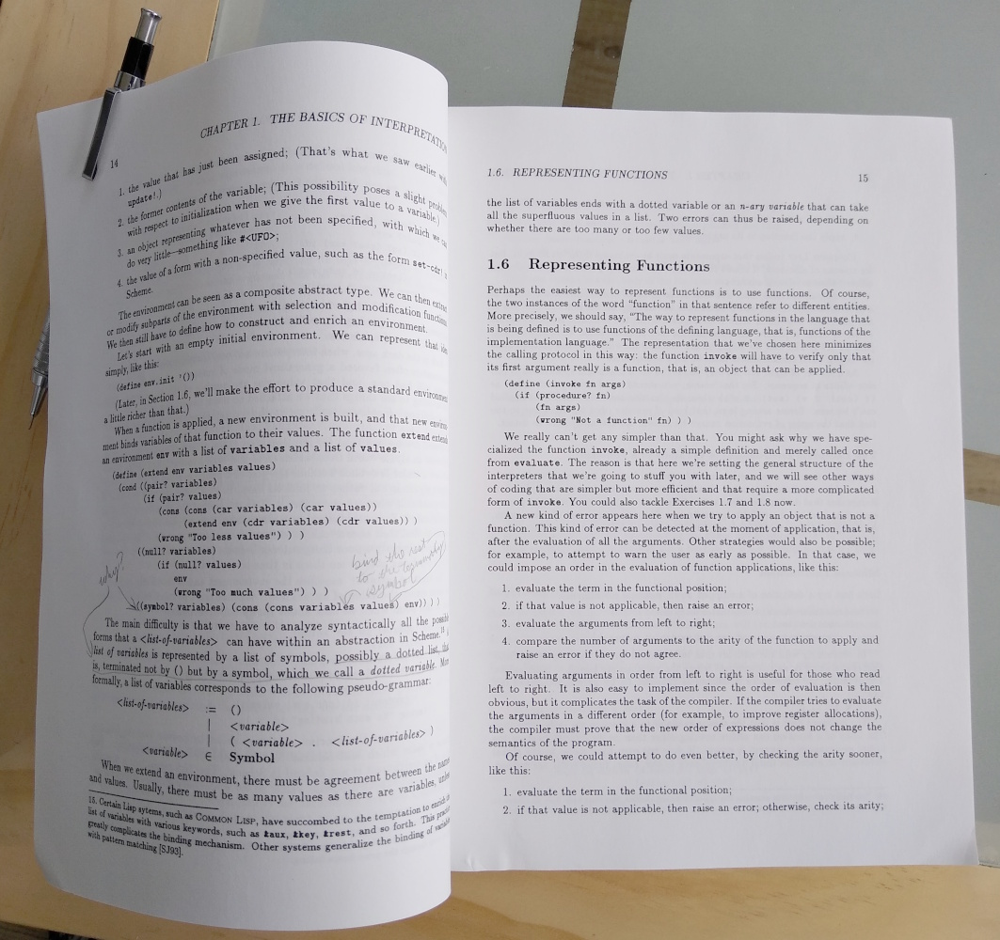

:stylesheet: style.css
:toc: left
:toc-title:
:sectanchors:

= LiSP 2022

Who wants to work through _Lisp in Small Pieces_ together?

[quote, LiSP p. xiv]
____
This book is organized into two parts. The first takes off from the
implementation of a naive Lisp interpreter and progresses toward the semantics
of Scheme... this approach of making the language more and more precise not
only initiates the reader gradually into authentic language-research, but it is
also a good introduction to denotational semantics...

The second part of the book goes in the other direction. Starting from
denotational semantics and searching for efficiency, we'll [implement] a
byte-code compiler... Then a second compiler, one compiling to the C
programming language.
____

A little intimidating, right? That's why we should do it together!

In particular, I (Chouser) read chapter 1 and thought I understood it. Then I
tried to re-implement the examples in Clojure and realized that I understood it
only in a shallow sense.  Maybe that's good enough, but maybe not.

If a bunch of us with different backgrounds and experience, different goals and
levels of time availability, all work through this book together, surely we'll
be able to help each other, learn from each other, and stay committed longer.

== The pitch

I've set up a Slack project where we can discuss what we're reading, post our
questions and successes, and plan how to stay in sync with each other.  We can
each engage with the text however we'd like -- implement the examples in Scheme,
Clojure, or something else; work through all or none of the exercises at the end
of each chapter; or just skim the book.  We can form sub-teams to pair on
particular exercises, if that's appealing.  This is open to anyone at all who
wants to join.

I've never done this before, so I'm not sure how it will go. We'll need to evaluate
and make adjustments once we're underway. We'll need some kind of pacing, a goal
for when to finish each chapter, so we can all move on to the next one together.
That means some of us will have to move on before we're _quite_ ready, and
others may wish for a faster pace and will just have to chill.  If that becomes
too uncomfortable you can of course go at a different pace, but then you're not
really doing it together "with us" anymore. :-)

I'm also hopeful people will want join a video call every so often, to show
something they've made, to discuss what they've learned, etc.  It'd be nice if
we got to know each others faces and voices a bit.  Scheduling these will likely
be difficult, so we may choose to record them and share via unlisted YouTube
link or some such.

== Next steps

1. Get the book

** You can get Kindle, hardcover, or paperback at https://www.amazon.com/Lisp-Small-Pieces-Christian-Queinnec/dp/0521545668[Amazon].
** The publisher, Cambridge Press, sells
   https://www.cambridge.org/us/academic/subjects/computer-science/programming-languages-and-applied-logic/lisp-small-pieces?format=AR[an
   eBook] version.
** There are some (not necessarily cheaper) copies on https://www.ebay.com/sch/i.html?_nkw=LISP+in+Small+Pieces&_sacat=267[EBay]
** Or maybe you can find one locally, depending on where you are.

2. Request a Slack invitation

** Send an email to `chouser` at `n01se.net` or on twitter to
   https://twitter.com/chrishouser[@chrishouser] (DMs are open, if you prefer)
   and I'll send you a link you can use to join the Slack discussion.

3. Get started!

** No need to wait -- start working through Chapter 1 however you'd like. I've
   implemented most of the examples in that chapter, but haven't started on any
   of the exercises.  Perhaps we should aim for mid-May to finish Chapter 1, but
   we can discuss that on Slack.

== Q&A

=== When do we start?

Right away! I'm writing this on 23 April 2022, and I think we should aim to be
done with chapter 1 in the next 2 to 4 weeks, so mid-May.

=== What if you tire before it's done?

The only firm commitment is the up-front cost to get the book.   That said, if
you don't like how it's going or are tired of the whole thing, you're free to
disengage at any time.  However, it is a central goal of this effort to
encourage each other to hang together and get all the way through the book. I
hope that as we find our selves individually challenged, we'll be able to lean
on each other and keep going.

=== Does it have rules?

How you engage with each chapter of the book is up to you. I hope to make the
time to read, implement the examples in Clojure, and complete at least a couple
exercises in each chapter.  If you'd like to do more or less than that, or do
something different, please do!

I _will_ insist that we treat each other with respect and empathy, and as a last
resort reserve the right remove anyone as I (Chouser) deem necessary.

=== Is there an object?

You can pick your own goals, and I think we'll each get value from this in
proportion to the effort we put in.  I hope to learn more about LISP and
compilers, and get to know others who are interested in these topics.

=== Who can join?

Technically, absolutely anyone. Practically, you'll need to comfortable with
programming languages and English (the book was originally written in French,
but our discussion will be carried out in English).  You'll need to be willing
and able to use the internet in general and Slack in particular.  If you've
already implemented compilers of your own, you may find the material boring and
the pace slow. If you've never used a LISP or implemented an interpreter, it may
require more work to keep up. If you have very little time to put into the
effort, you may not get a lot out of it. All of these outcomes are fine with me
if they're fine with you.

=== How long will it take?

It's hard to predict when we'll be done with the entire book, because we'll
figure out the appropriate pace for each chapter as we go.  Given the density of
the text and the breadth of the exercises in each chapter, and the fact that we
all have other claims on our time, 4 weeks per chapter may feel aggressive.
There are 11 chapters, making it likely to take us at least a year.  Perhaps
we'll decide to take some breaks along the way, making it longer but less
intense.

=== Is there some other way to ease into writing a LISP interpreter?

If you're interested in learning how to write a LISP, but this book sounds like
a bit much to you, or there's something about this proposed format you don't
like, I would recommend looking into https://github.com/kanaka/mal[Joel Martin's
Make A Lisp].  MAL provides clear step-by-step instructions and guardrail tests
to help you implement a Clojure-inspired LISP interpreter in the language of
your choice.

=== How do I ask other questions?

If you have other questions or concerns, write me on twitter
(https://twitter.com/chrishouser[@chrishouser]) or via email (`chouser` at
`n01se.net`).

== Thanks

Thanks to Viasat and the LonoCloud team for fostering an environment that can
inspire an activity like this, and to Denise Zimmerman and Aaron Brooks for
edits on a draft of this page.

--Chouser
